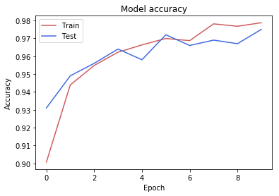

# Digit Sum prediction

This is the module to predict the sum of 4 digits from a given image.

## Running Instructions

To prepare for running, after having cloned the repository, navigated to this directory, and created a local python environment, please run the following commands.

```sh
python -m pip install -r requirements.txt
```

To train the model again, run the following.
```sh
python train.py
```

To get predictions on the current dataset, run
```sh
python predict.py
```
This tests on the current file. Please edit the code in `predict.py` at the top of the file to specify the path of the new file to test on.

## Accuracy and Loss curves

The accuracy of the model predictions on MNIST grow as follows (pure MNIST, not sum of digits, as that is a subtask).


The loss of the model predictions on MNIST decay as shown below (again pure MNIST, single digit).


## Final Accuracy

The model on the input training dataset of images with 4 digits gives a 70.2% accuracy.

